# Grid-Connected Solar PV System Design & Performance Analysis

[](https://sam.nrel.gov/)
[](./main.tex)
[](./PV-project.pdf)

A professional-grade commercial-scale photovoltaic (PV) system design and performance simulation conducted for the **University of Sharjah (UOS) Male Sports Complex**, Sharjah, UAE. The design employs **System Advisor Model (SAM)** to optimize a **367.85 kW DC** double-tilted roof-mounted array.

---

## 📍 Site Assessment & Parameters

* **Location**: UOS Male Sports Complex, Sharjah, United Arab Emirates
* **Coordinates**: `25.284504, 55.478225`
* **Total Roof Area**: 2,228.98 m² (~1,114.49 m² available per subarray)
* **Roof Profile**: Double tilted roof with a flush-mount module tilt of **$5^\circ$**
* **Measured Roof Azimuths**:
  * **Subarray 1 (Northeast-facing)**: $36.22^\circ$
  * **Subarray 2 (Southwest-facing)**: $216.22^\circ$

---

## ⚙️ Technical Specifications

| Parameter | Specification | Details / Rationale |
| :--- | :--- | :--- |
| **System Capacity (DC)** | **367.85 kW** | Combined capacity across both subarrays |
| **AC Power Cap** | **300 kW** | Capped at combined inverter output capacity |
| **Inverters** | **5 × SMA Sunny Tripower 60kW** | Total 300 kW AC rating, commercial string design |
| **PV Modules** | **1,116 × Trina Solar TSM-330** | High-density monocrystalline (17.0% efficiency) |
| **Array Layout** | **2 Subarrays** | Perfect geometric alignment with double tilted roof |
| **String Layout** | **18 Modules per String** | 31 Parallel strings per Subarray (Total 62 strings) |
| **DC/AC Ratio** | **1.23** | Highly optimized ratio minimizing inverter clipping |

---

## 📐 Initial Calculations (STC @ 1000 W/m²)

### 1. System Size Capacity Limits
Using the measured roof area and a standard module efficiency of 17%, the maximum raw capacity limit was calculated:
$$
C_{\text{array}} = A_{\text{roof}} \times \eta_{\text{module}} \times 1000 \text{ W/m}^2
$$
$$
C_{\text{array}} = 2228.98 \text{ m}^2 \times 0.17 \times 1000 \text{ W/m}^2 = 378,926 \text{ W (378.9 kW DC)}
$$
The final physical design installs **367.85 kW DC** ($1,116$ modules), utilizing **97.1%** of the absolute geometric limit to preserve structural margin and avoid overlapping edges.

### 2. Inverter Sizing & Ratio Optimization
Targeting a commercial DC/AC ratio of approximately 1.2:
$$
\text{Target Inverter AC Capacity} = \frac{\text{System Size (DC W)}}{1.2} = \frac{378,926 \text{ W}}{1.2} \approx 315,771 \text{ W}
$$
By using **five 60 kW SMA Sunny Tripower inverters** (300 kW total AC capacity), we achieve a highly optimized DC/AC ratio of **1.23**, ensuring standard commercial performance and minimal clipping loss.

### 3. Module String Configuration Limits
Based on the selected SMA inverter specific input voltage range (**Min $V_{DC} = 415\text{V}$**, **Max $V_{DC} = 980\text{V}$**) and the module's open-circuit voltage ($V_{oc} = 46.2\text{V}$):
$$
\text{Max Modules per String} = \frac{\text{Inverter Max V}_{DC}}{\text{Module } V_{oc}} = \frac{980\text{V}}{46\.2\text{V}} = 21.2 \rightarrow \mathbf{21 \text{ modules max}}
$$
$$
\text{Min Modules per String} = \frac{\text{Inverter Min V}_{DC}}{\text{Module } V_{oc}} = \frac{415\text{V}}{46.2\text{V}} = 8.98 \rightarrow \mathbf{9 \text{ modules min}}
$$
The selected layout of **18 modules per string** perfectly centers within this window, ensuring the system remains operational under all thermal extremes without trigger-tripping the inverter's voltage safety margins.

---

## 📊 Performance & Simulation Results

The simulation, performed using high-resolution meteorological data for Sharjah, UAE, produced the following key results:

### System Productivity Summary
* **Annual AC Energy Yield**: **629,127 kWh**
* **Capacity Factor**: **23.9%**
* **Performance Ratio (PR)**: **0.78**

### Subarray Comparison & Productivity
Due to solar geometry and the local path of irradiance, the Southwest-facing roof provides significantly higher productivity than its Northeast-facing counterpart:
* **Subarray 1 (Northeast, $36.22^\circ$)**: **327,751 kWh** Gross DC / Year
* **Subarray 2 (Southwest, $216.22^\circ$)**: **346,997 kWh** Gross DC / Year (+5.8% productivity gain)

### Monthly Distribution

```mermaid
gantt
    title System Generation Performance Profile
    dateFormat  X
    axisFormat %s
    section Active Sizing
    Peak Yield (May ~66,000 kWh)   :active, 0, 10
    Stable Generation (Mar - Oct) : 10, 80
    Least Yield (Jan ~39,000 kWh)  : 80, 100
```

* **Peak Production**: **May** with approximately **66,000 kWh**, driven by optimal UAE spring temperatures and peak clear-sky irradiance.
* **Minimum Production**: **January** with approximately **39,000 kWh**, caused by shorter winter days and lower solar elevation.

---

## 📉 Loss Analysis & Mitigation

Detailed loss profiling in SAM reveals that the system is highly optimized, but affected by the harsh desert environment of the Arabian Peninsula:

```
[Total Irradiance] -> (Soiling Loss: 5.0%) -> (Temperature Deviation: 7.999%) -> (Inverter Efficiency: 1.5%) -> [629,127 kWh AC Output]
```

### 1. Inverter Sizing & Sizing Validation
Execution of the **System Sizing macro** validated the array-to-inverter pairing:
* **Inverter Power Clipping Loss**: **0.002%** (Negligible)
* **Rationale**: The 1.23 DC/AC ratio is exceptionally matched; the array's full peak output is converted to AC without bottlenecking or power shedding.

### 2. Environmental & Module Inefficiencies
* **Soiling Loss (5.0%)**: Dust, silt, and sand accumulation degrade light transmission to the cells.
* **Module Temperature Deviation (7.999%)**: UAE's extreme ambient heat pushes module operating temperatures far above the 25°C STC baseline, inducing thermal power degradation.

### 💡 Optimization Strategies
To recover lost energy and maximize long-term asset value, we recommend the following commercial mitigations:
1. **Automated Dust Mitigation**: Implement a bi-weekly or monthly automated waterless dry-brush cleaning cycle to fully recover the 5% ($~31,450$ kWh) annual soiling losses.
2. **Heterojunction (HJT) or TOPCon Modules**: For future expansions, transition to N-type silicon modules (like TOPCon or HJT cells) which exhibit a lower temperature coefficient (e.g., $-0.26\%/^\circ\text{C}$ vs $-0.38\%/^\circ\text{C}$ for standard P-type). This minimizes power degradation when roof temperatures exceed 60°C.

---

## 📁 Repository Contents

* [**`main.tex`**](./main.tex): The complete LaTeX source code compiled using the `IEEEtran` standard conference template.
* [**`SAM.pdf`**](./SAM.pdf): Detailed System Advisor Model (SAM) PDF simulation profile and sizing configurations.
* [**`PV-project.pdf`**](./PV-project.pdf): Fully compiled academic PDF report detailing the site assessment, layout diagrams, and mathematical calculations.

---

## 🎓 Academic Context
This design was developed for the **`0406320 Solar PV Systems`** course at the **University of Sharjah**, College of Computing and Informatics, Sharjah, UAE.

* **Author**: Oumar Ibrahim
* **Faculty**: College of Computing and Informatics
* **Date**: Spring 2026
